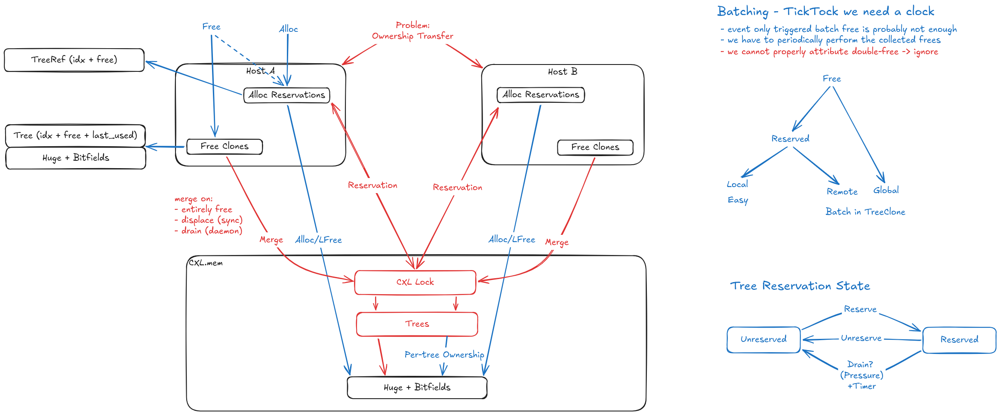

# CXL Memory without cache coherence

- Current rework of LLFree support memory without cache coherence.
- This requires manual cacheline invalidation and special locking primitives.

## Architecture

- Idea: Alloc/free from tree clones that are merged at certain points.
