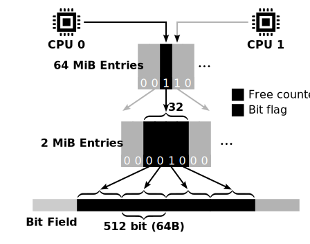

# LLFree: Lock- and Log-free Allocator

This repository contains prototypes of page allocators.
They are designed for multicore, hybrid systems with volatile and non-volatile memory.

The two main design goals are multicore scalability and crash consistency.

**Related Projects**
- Benchmarks: https://github.com/luhsra/llfree-bench
- Modified Linux: https://github.com/luhsra/llfree-linux
- Benchmark Module: https://github.com/luhsra/linux-alloc-bench

## Publication

**LLFree: Scalable and Optionally-Persistent Page-Frame Allocation**<br>
Lars Wrenger, Florian Rommel, Alexander Halbuer, Christian Dietrich, Daniel Lohmann<br>
In: 2023 USENIX Annual Technical Conference (USENIX '23); USENIX Association

## Usage

To compile and test the allocator, you have to [install rust](https://www.rust-lang.org/learn/get-started).

The `nightly` version `1.76.0` (or newer) is required for inline assembly and custom compiler toolchains.

```sh
# Init dependencies
git submodule update --init

# Release build
cargo build -r

# Running unit-tests
cargo test -- --test-threads 1
```

> Note: This project uses certain UNIX features directly (for memory mapping and thread pinning) and doesn't work on Windows without modifications.

## Project structure



The [core](core/) directory contains the main `llfree` crate and all the allocators.
In general, LLFree is separated into a lower allocator, responsible for allocating pages of 4K up to 4M, and an upper allocator, designed to prevent memory sharing and fragmentation.

The persistent lower allocator can be found in [lower](core/src/lower.rs).
Internally, this allocator has 512-bit-large bit fields at the lowest level.
They stores which 4K pages are allocated.
The second level consists of 2M entries, one for each bit field. These entries contain a counter of free pages in the related bit field and a flag if the whole subtree is allocated as a 2M huge page.
These 2M entries are further grouped into trees with 32 entries (this can be defined at compile-time).

The [llfree](core/src/llfree.rs) module contains the upper allocator.
Its interface is defined in [lib.rs](core/src/lib.rs), along with various unit and stress tests.
The upper allocator depends on the lower allocator for the actual allocations and only manages the higher-level trees.
Its purpose is to improve performance by preventing memory sharing and fragmentation.
It is completely volatile and has to be rebuilt on boot.

The allocator's data structures are defined in [core/src/entry.rs](core/src/entry.rs) and [core/src/trees.rs](core/src/trees.rs).

This project also includes the C reimplementation ([llfree-c](https://github.com/luhsra/llfree-c)) in [llc](core/src/llc.rs).
The unit tests can be executed for the C by using the `--features llc` argument:

```sh
# fetch the C implementation
git submodules update --init
# build & test the C implementation
cargo test --features llc -- --test-threads 1
```

## Benchmarks

The benchmarks can be found in [bench/src/bin](bench/src/bin) and the benchmark evaluation and visualization in the [llfree-bench](https://github.com/luhsra/llfree-bench) repository.

These benchmarks can be executed with:

```bash
cargo perf bench -- bulk -x1 -x2 -x4 -t4 -m8 -o results/bench.csv LLFree
```

This runs the `bulk` benchmark for 1, 2, and 4 threads (`-t4` max 4 threads) on 24G DRAM and stores the result in `results/bench.csv`.

To execute the benchmark on NVM, use the `--dax` flag to specify a DAX file to be mapped.

> For more info on the cli arguments run `cargo perf bench -- -h`.
>
> The debug output can be suppressed with setting `RUST_LOG=error`.


## Integrating into the Linux Kernel

- See: https://github.com/luhsra/llfree-linux


## Profiling

- See: https://perf.wiki.kernel.org/index.php/Tutorial

General statistics:

```sh
perf stat -e <events> target/release/bench <args>
```

> Additional details with `-d -d -d`...
>
> Also `hotspot` is a great analysis tool for these statistics

Recording events:

```sh
perf record -g -F 999 target/release/bench <args>
```

After conversion `perf script -F +pid > test.perf`, this can be opened in firefox: https://profiler.firefox.com/

- See: https://profiler.firefox.com/docs/#/./guide-perf-profiling
