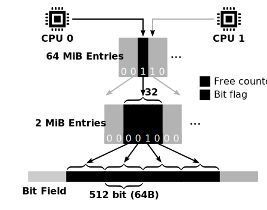

# LLFree: Lock- and Log-free Allocator

This repository contains the LLFree page frame allocator.
It is designed for multicore scalability and fragmentation avoidance and outperforms the Linux kernel page allocator in both regards.

**Related Projects**

- C Implementation: https://github.com/luhsra/llfree-c
- Benchmarks: https://github.com/luhsra/llfree-bench
- Modified Linux: https://github.com/luhsra/llfree-linux
- Benchmark Module: https://github.com/luhsra/linux-alloc-bench

## Publications

**LLFree: Scalable and Optionally-Persistent Page-Frame Allocation**<br>
Lars Wrenger, Florian Rommel, Alexander Halbuer, Christian Dietrich, Daniel Lohmann<br>
In: 2023 USENIX Annual Technical Conference (USENIX '23); USENIX Association

**HyperAlloc: Efficient VM Memory De/Inflation via Hypervisor-Shared Page-Frame Allocators**
Lars Wrenger, Kenny Albes, Marco Wurps, Christian Dietrich, Daniel Lohmann
In: Proceedings of the Twentieth European Conference on Computer Systems (EuroSys '25); ACM 2025

## Usage

To compile and test the allocator, you have to [install Rust](https://www.rust-lang.org/learn/get-started).

The `stable` version `1.93.0` (or newer) is required.

```sh
# Release build
cargo build -r

# Run unit-tests
cargo test -p llfree
```

> Note: This project uses certain UNIX features directly (for memory mapping and thread pinning) and doesn't work on Windows without modifications.

### As Library

Add the crate as a dependency to `Cargo.toml`.

```toml
[dependencies]
llfree = { git = "https://github.com/luhsra/llfree-rs.git" }
```

The following example shows how to use the allocator to allocate and free page frames.

```rust
use llfree::{Alloc, LLFree, Tiering, MetaData, Init};

// Assuming a 4K page size and 1 GiB of memory
let frames = 1 << 30 / 4096;

// Specify tiers and policy
let (tiering, request) = Tiering::simple(1);
// Allocate the metadata buffers
let ms = LLFree::metadata_size(&tiering, frames);
let meta = MetaData::alloc(ms);
// Initialize the allocator
let alloc = LLFree::new(frames, Init::FreeAll, &tiering, meta).unwrap();

// Allocate and free page frames
let (frame, _tier) = alloc.get(None, request(0, 0)).unwrap();
// ...
alloc.put(frame, request(0, 0)).unwrap();
```

## Project Structure



The [core](core/) directory contains the main `llfree` crate and all the allocators.
In general, LLFree is separated into a lower allocator, responsible for allocating pages of 4K up to 4M, and an upper allocator, designed to prevent memory sharing and fragmentation.

The persistent lower allocator can be found in [lower](core/src/lower.rs).
Internally, this allocator has 512-bit-large bitfields at the lowest level.
They store which 4K pages are allocated.
The second level consists of 2M entries, one for each bitfield. These entries contain a counter of free pages in the related bitfield and a flag if the whole subtree is allocated as a 2M huge page.
These 2M entries are further grouped into [trees](core/src/trees.rs) with 8 entries.

The [llfree](core/src/llfree.rs) module contains the upper allocator.
Its interface is defined in [lib.rs](core/src/lib.rs), along with various unit and stress tests.
The upper allocator depends on the lower allocator for the actual allocations and only manages the higher-level trees.
Its purpose is to improve performance by preventing memory sharing and fragmentation.

## Integration Tests

The [llfree-eval](eval) crate contains many [integration](eval/tests/integration.rs) tests.

```sh
cargo test -p llfree-eval --test integration
```

These integration tests can also be used to validate the C reimplementation ([llfree-c](https://github.com/luhsra/llfree-c)) in [llc](eval/src/llc.rs).
They can be run against the C implementation by enabling the `llc` feature:

```sh
# C repo is included as a git submodule
git submodule update --init --checkout llc
# build & test the C implementation
cargo test -p llfree-eval -F llc --test integration
```

## Benchmarks

The benchmarks can be found in [eval/src/bin](eval/src/bin) and the benchmark evaluation and visualization in the [llfree-bench](https://github.com/luhsra/llfree-bench) repository.

These benchmarks can be executed with:

```bash
cargo perf bench -- bulk -x1 -x2 -x4 -t4 -m8 -o results/bench.csv LLFree
```

This runs the `bulk` benchmark for 1, 2, and 4 threads (`-t4` max 4 threads) on 8 GiB DRAM (`-m8`) and stores the result in `results/bench.csv`.

To execute the benchmark on NVM, use the `--dax` flag to specify a DAX file to be mapped.

> For more info on the CLI arguments run `cargo perf bench -- -h`.
>
> The debug output can be suppressed with setting `RUST_LOG=error`.

## Profiling

- See: https://perf.wiki.kernel.org/index.php/Tutorial

General statistics:

```sh
perf stat -e <events> target/release/bench <args>
```

> Additional details with `-d -d -d`...
>
> Also `hotspot` is a great analysis tool for these statistics

Recording events:

```sh
perf record -g -F 999 target/release/bench <args>
```

After conversion `perf script -F +pid > test.perf`, this can be opened in firefox: https://profiler.firefox.com/

- See: https://profiler.firefox.com/docs/#/./guide-perf-profiling
